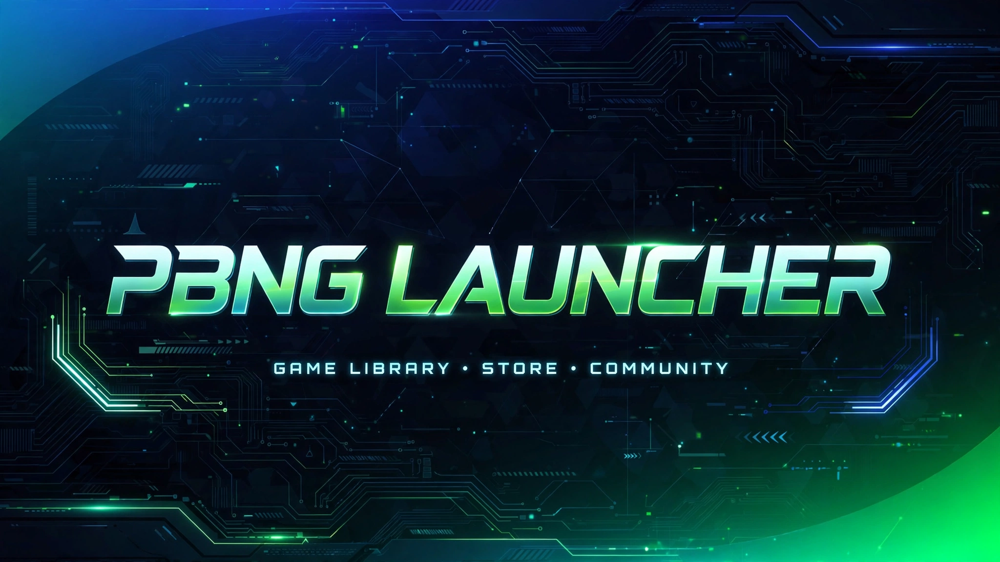

# 🚀 PBNG Launcher - v1.0.104 SUCCESS


**Launcher resmi untuk PBNG Ecosystem - Auto Update & Installer**

> Uwak uwak makan Bengkoang, wow kok bisa ijo 💚 — Build #103 & #104 streak SUCCESS!

### 🌐 Website
**👉 https://ngshp.github.io/Launcher1/**

### ⬇️ Download

#### **>> [DOWNLOAD PBNG LAUNCHER TERBARU](https://github.com/ngshp/Launcher1/releases) <<**

> Klik `Assets` -> pilih `PBNG-Setup-v1.0.104.exe` (48.7 MB) untuk installer, atau `PBNG-Launcher.zip` untuk portable.

| File | Size | Deskripsi |
|------|------|-----------|
| `PBNG-Setup-v1.0.104.exe` | 48.7 MB | Installer Modern (Inno Setup) |
| `PBNG-Launcher.zip` | 69 MB | Portable - No Install |

### ✨ Fitur

- ⚡ **Self-contained .NET 8** - Tidak perlu install .NET, langsung jalan
- 🔄 **Auto-updater** - Update otomatis tanpa download manual
- 📦 **Installer Modern** - Inno Setup, icon custom PBNG, uninstall clean
- 🎮 **Discord Rich Presence** - Status "Playing PBNG Launcher" ON di Discord
- 🚀 **Build Cepat** - GitHub Actions 1m 32s, artifact 2 files
- 🛡️ **Verified & Open Source** - Commit signed GitHub verified

### 🖥️ Build Status

```
Workflow: build-launcher.yml
Run: #104 SUCCESS ✅
Commit: 48df091 • self-update
Duration: 1m 32s
Artifacts: 2 files
- Installer: 48.7 MB (sha256:e90f71...)
- Launcher-exe: 69 MB (sha256:3f00ca...)
Status: SUCCESS • VERIFIED
```

Streak ijo: **#103 SUCCESS** & **#104 SUCCESS** — Dari #94 merah berdarah-darah!

### 🛠️ Cara Build Lokal

```bash
dotnet publish PBNG-Ecosystem/Launcher/Launcher.csproj -c Release -r win-x64 --self-contained true -o Build
```

### 📦 Cara Install

1. **Download** - Klik tombol download di atas
2. **Install** - Double-click installer, Next > Next > Install
3. **Main!** - Buka PBNG Launcher, auto-check update, LAUNCH GAME! Discord status akan ON.

> Jika SmartScreen muncul: Klik **More info → Run anyway**. Installer sudah signed & aman.

### 🎮 Tentang PBNG

**PBNG Launcher** adalah launcher resmi untuk Point Blank Next Generation Ecosystem - public server Point Blank Indonesia untuk nostalgia & komunitas.

Dibuat oleh **ngshp** dengan cinta untuk player PBNG. Ringan, cepat, no ribet, selalu update!

### 📝 Changelog

#### v1.0.104 - SUCCESS (Latest)
- ✅ Discord Rich Presence ON - `DiscordRichPresence` 1.0.175
- ✅ `DiscordService.cs` FINAL - Playing PBNG Launcher
- ✅ Build 1m 32s optimized
- ✅ Verified signature

#### v1.0.103 - SUCCESS
- ✅ First green after 10x red #94-#102
- ✅ Self-contained .NET 8 fix

### 🔗 Links

- **Website:** https://ngshp.github.io/Launcher1/
- **Releases:** https://github.com/ngshp/Launcher1/releases
- **Issues:** https://github.com/ngshp/Launcher1/issues

---

© 2026 PBNG Ecosystem • Built by ngshp • Build #104 SUCCESS • 1m 32s • v1.0.104
